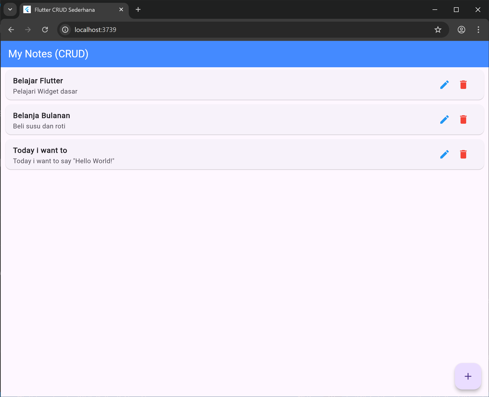
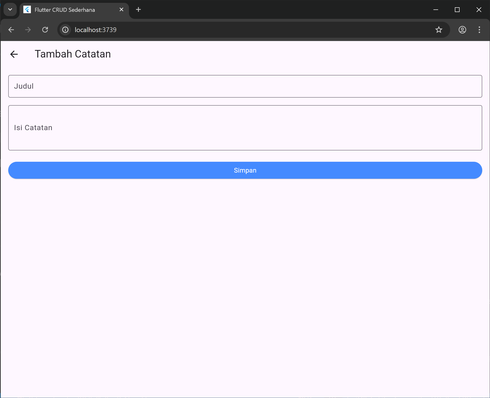

# 📝 Flutter Simple CRUD Notes App

Aplikasi Catatan sederhana yang dibangun menggunakan **Flutter** untuk mendemonstrasikan operasi dasar **CRUD** (Create, Read, Update, Delete). Project ini cocok sebagai referensi pembelajaran struktur data dan navigasi antar layar di Flutter.

---

## 🚀 Fitur Utama

* **Create**: Menambahkan catatan baru (Judul & Isi).
* **Read**: Menampilkan daftar catatan dalam bentuk List Card yang rapi.
* **Update**: Mengedit catatan yang sudah ada.
* **Delete**: Menghapus catatan dari daftar.
* **Validation**: Form dilengkapi dengan validasi input (tidak boleh kosong).

## 🛠️ Tech Stack yang Digunakan

* **Framework**: [Flutter](https://flutter.dev/)
* **Language**: [Dart](https://dart.dev/)
* **UI Style**: Material Design 3

## 📸 Screenshots

| Home Screen (List) | Form Screen (Add/Edit) |
|---|---|
|  |  |

## ⚙️ Cara Menjalankan Project

1.  **Clone repository ini:**
    ```bash
    git clone https://github.com/renprzty/flutter-note.git
    ```
2.  **Masuk ke direktori project:**
    ```bash
    cd flutter-crud-app
    ```
3.  **Ambil dependencies:**
    ```bash
    flutter pub get
    ```
4.  **Jalankan aplikasi:**
    ```bash
    flutter run
    ```

---
Dibuat dengan ❤️ untuk pembelajaran Flutter.
